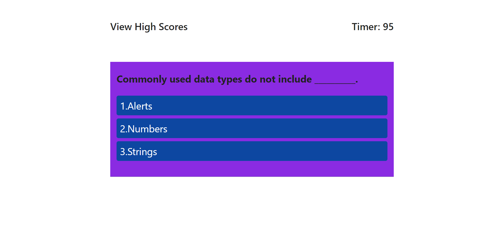

# coding-quiz

## This was a timed quiz made with JavaScript. The timer will start upon beginning the quiz and time will be deducted for incorrect answers.

##Screen Shots 

## I used simpleCSS in my project.